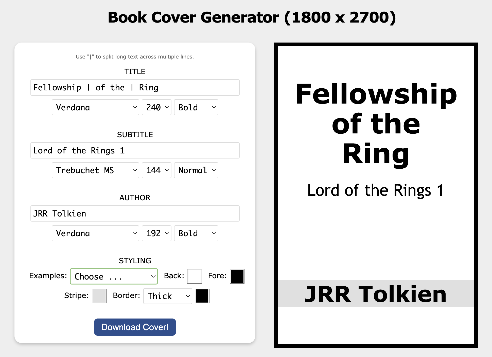

# book-cover

Stand-alone web page to generate very simple book covers as 1800x2700 PNGs. Supports title, subtitle, author, colours, fonts, and an optional background image.

Useful if, for example, you're adding a large number of books to Calibre and don't have the time to find decent cover images for them all at once.

Fully working demo at: [https://book-cover.netlify.app](https://book-cover.netlify.app/)

- Download the [`index.html`](./index.html) file
- Open it in your browser
- Update the title, subtitle, and author
- Set your font choices
- Choose some colours (or an example)
- Optionally upload a background image
    - Should be 1800x2700 pixels
    - Opacity adjustable from 10% to 100%
      - The default is 80%
- Hit the `Download Cover` button

[MIT license](./LICENSE)

---

