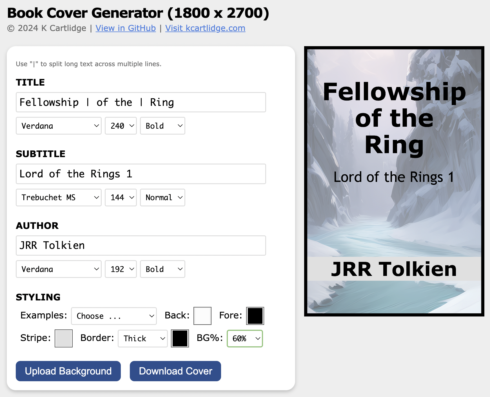

# book-cover

Stand-alone web page to generate very simple text-only book covers as 1800x2700 PNGs.

Useful if, for example, you're adding a large number of books to Calibre and don't have the time to find decent cover images for them all at once.

- Download the [`index.html`](./index.html) file
- Open it in your browser
- Update the title, subtitle, and author
- Set your font choices
- Choose some colours (or an example)
- Hit the `Download Cover!` button

[MIT license](./LICENSE)

---

